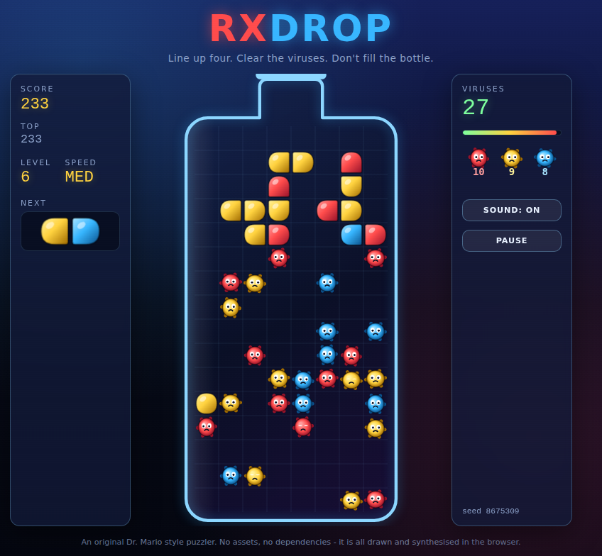
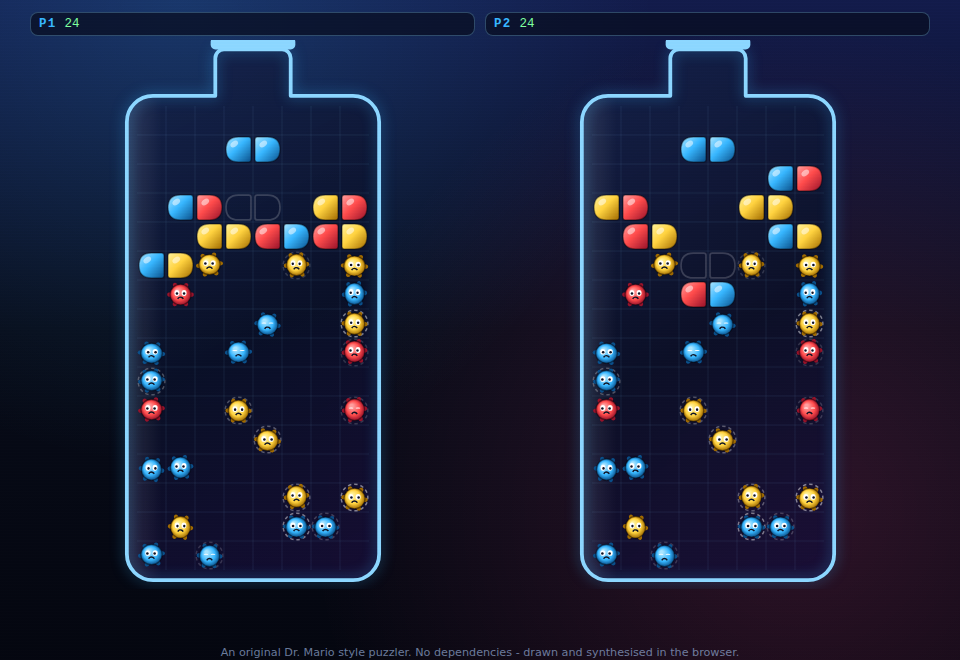

# RxDrop

A Dr. Mario style falling-capsule puzzler that runs in the browser. Match four
of a colour to wipe out the viruses, and try not to fill the bottle.

No frameworks and no build step: every pill, virus and sound effect is drawn or
synthesised at runtime. It installs to a home screen, plays with the network
off, has a daily challenge and local two-player versus, and adds one mechanic
the genre has not had before - **antibiotic resistance**.



Local versus, both bottles dealt the same layout and the same capsules:



## Play

Clone the repository and serve it:

```sh
git clone https://github.com/danielwjohnston/rxdrop.git
cd rxdrop
npm start          # http://localhost:8080
```

`npm start` runs a tiny static file server from `tools/serve.js` - ES modules
need a real origin, so opening `index.html` straight off disk will not work.
Any other static server does the job just as well.

A link can set up a specific game, which is handy for sharing a layout:

```
http://localhost:8080/?level=12&speed=HIGH&seed=8675309
```

## Modes

**Solo** — the classic ladder. Pick a level from 0 to 20 and a speed, clear
every virus, move on to the next level.

**Daily** — one bottle a day, the same for everyone, derived from the UTC date
alone. No server and no accounts: your device computes the same seed as
everyone else's. Finishing gives you a spoiler-free result line to share, and
your best attempt of the day is kept.

**Versus** — two players on one keyboard (or a gamepad each). Both bottles get
the same layout and the same capsules, so it is a contest of play rather than
luck. Clear more than the minimum four, or set off a cascade, and the surplus
falls into your opponent's bottle as loose garbage halves. You win by clearing
your viruses first or by outlasting them.

## Antibiotic resistance

The optional twist, and the part that is new to this genre. Turn **Resistance**
on and the viruses stop being patient furniture:

- every virus carries a hidden resistance counter, seeded unevenly so they do
  not all ripen at once
- every eight capsules, all of them age by one
- a virus that reaches the limit **mutates to a different colour** and resets

A virus about to turn wears a pulsing dashed ring, and the panel shows how close
the board is to its next mutation. The setup you have been carefully building
around a red virus is worth nothing the moment it turns blue, so the mechanic
punishes hoarding and rewards clearing while you can. A mutation never completes
a run on its own: it is always a threat, never a free clear.

It fits the theme exactly - leave an infection half-treated and it develops
resistance.

## Offline

RxDrop is a progressive web app. Open it once and a service worker precaches
every file; after that it runs with no network at all, and browsers will offer
to install it to your home screen or desktop. The daily challenge works offline
too, since the puzzle comes from the date rather than a server.

**On iPhone and iPad**, Safari does not show an install prompt - installing is
manual: **Share → Add to Home Screen**. Launched from the home screen it runs
full screen with no browser chrome. Service workers and the Cache API have
worked on iOS since 11.3, so offline play works the same way; iOS 26 opens
home-screen sites as web apps by default, and the `apple-mobile-web-app-*`
tags here cover older versions. Two iOS quirks worth knowing: sound only starts
after your first tap (Safari requires a gesture before audio), and versus needs
a keyboard or two controllers, since the touch pad only drives player one.

## Controls

| Action | Keyboard | Touch | Gamepad |
| --- | --- | --- | --- |
| Move | <kbd>←</kbd> <kbd>→</kbd> or <kbd>A</kbd> <kbd>D</kbd> | buttons, or drag the bottle | d-pad / left stick |
| Rotate | <kbd>Z</kbd> / <kbd>X</kbd>, <kbd>↑</kbd> | buttons, or tap the bottle | A / B |
| Soft drop | <kbd>↓</kbd> or <kbd>S</kbd> | button, or swipe down | d-pad down |
| Hard drop | <kbd>Space</kbd> | DROP, or flick down | d-pad up / Y |
| Pause | <kbd>P</kbd> or <kbd>Esc</kbd> | Pause | Start |
| Restart level | <kbd>R</kbd> | Restart, on the pause card | Back / Select |
| Mute | <kbd>M</kbd> | Sound | X / Square |

Holding left or right auto-shifts after a short delay, so you can slide a
capsule across the bottle in one press.

In **versus** the keyboard splits in two, and a gamepad each works as well
(pad one drives player one):

| Action | Player 1 | Player 2 |
| --- | --- | --- |
| Move | <kbd>A</kbd> <kbd>D</kbd> | <kbd>&larr;</kbd> <kbd>&rarr;</kbd> |
| Rotate | <kbd>Q</kbd> / <kbd>W</kbd> | <kbd>,</kbd> / <kbd>.</kbd> |
| Soft drop | <kbd>S</kbd> | <kbd>&darr;</kbd> |
| Hard drop | <kbd>E</kbd> | <kbd>/</kbd> |

Gamepads use the standard layout, so the face buttons are A/B on an Xbox pad
and cross/circle on a PlayStation one. Browsers only hand a page a gamepad
after a button is pressed on it, so give the pad one press before expecting it
to do anything. Restart sits on Back/Select rather than a face button, since it
throws the current run away.

## Rules

- The bottle is 8 columns by 16 rows and starts with `4 × (level + 1)` viruses,
  from 4 at level 0 up to 84 at level 20. Higher levels stack them closer to
  the neck.
- Capsules fall in two halves, each one of three colours. Line up **four or
  more** of one colour in a row or column and they are destroyed - viruses
  included.
- Clearing part of a capsule leaves the other half behind, and loose halves
  fall. If they complete another line the chain keeps going, and each extra
  stage in a cascade multiplies the score.
- Each virus in a single clear is worth double the last: at LOW speed one virus
  scores 100, two score 300, three score 700, and so on. MED and HI pay more.
- Gravity gets faster every ten capsules.
- Clear every virus to finish the level. If a new capsule cannot fit at the top
  of the bottle, the game is over.

## Development

```sh
npm test           # 124 unit tests, no dependencies, well under a second
npm run test:watch # re-run on change

# End-to-end checks in a real browser (Playwright is not a dependency):
npm i --no-save playwright && npx playwright install chromium
npm run test:browser  # 20 checks: menus, controls, versus, daily, offline, mobile

npm run gauntlet   # the full protocol below: every stage, one gate
```

### The UltraGauntlet

`npm run gauntlet` runs nine adversarial stages in series - determinism, hostile
clocks, boundaries, fuzzing, the resistance mechanic, versus garbage
conservation, a frame-budget check, and the browser suite - and fails the run if
any stage fails. [docs/ultragauntlet.md](docs/ultragauntlet.md) explains where
it comes from, what each stage attacks, and the defects it has already caught.

### Layout

```
index.html            markup for the bottle, HUD and menus
src/constants.js      board size, colours, speeds, timings
src/rng.js            seedable PRNG - one seed reproduces a whole game
src/board.js          the grid: matching, gravity, cascades, virus layouts
src/pill.js           capsule geometry, rotation with wall kicks, locking
src/game.js           the state machine: lock, clear, cascade, spawn, score
src/versus.js         two games, garbage routed between them
src/daily.js          the date-seeded daily challenge
src/renderer.js       canvas drawing
src/audio.js          Web Audio synthesis: two chiptune loops and the effects
src/input.js          keyboard, touch, swipe and gamepad
src/main.js           screens, HUD, persistence and the animation loop
test/                 unit tests for the rules, plus randomised soak runs
sw.js                 service worker: precache everything, play offline
manifest.webmanifest  installable app metadata
tools/serve.js        the static server behind `npm start`
tools/browser-check.mjs  end-to-end checks in a real browser
tools/gauntlet.mjs    the UltraGauntlet: nine stages, one gate
docs/ultragauntlet.md what the gauntlet is and why each stage exists
```

The rules live entirely in `board.js`, `pill.js` and `game.js`, which never
touch the DOM. That is what lets the test suite play thousands of frames
headlessly and assert that the board never floats a capsule half or leaves a
match unresolved.

## Deploying

`.github/workflows/pages.yml` publishes the repository to GitHub Pages on every
push to `main` - the game is already static, so there is nothing to build.

GitHub Pages has to be switched on once by a repository admin, under
**Settings -> Pages -> Source -> "GitHub Actions"**. The workflow asks the
`configure-pages` action to enable it automatically, but a workflow token is
not always allowed to create the Pages site, in which case the deploy fails
with `Create Pages site failed. Error: Resource not accessible by integration`
until the switch is flipped by hand. After that, re-run the workflow (or push
to `main`) and the game goes live at
https://danielwjohnston.github.io/rxdrop/.

## Licence

MIT - see [LICENSE](LICENSE). RxDrop is an original implementation inspired by
the falling-capsule genre; it contains no Nintendo code, artwork or audio.
